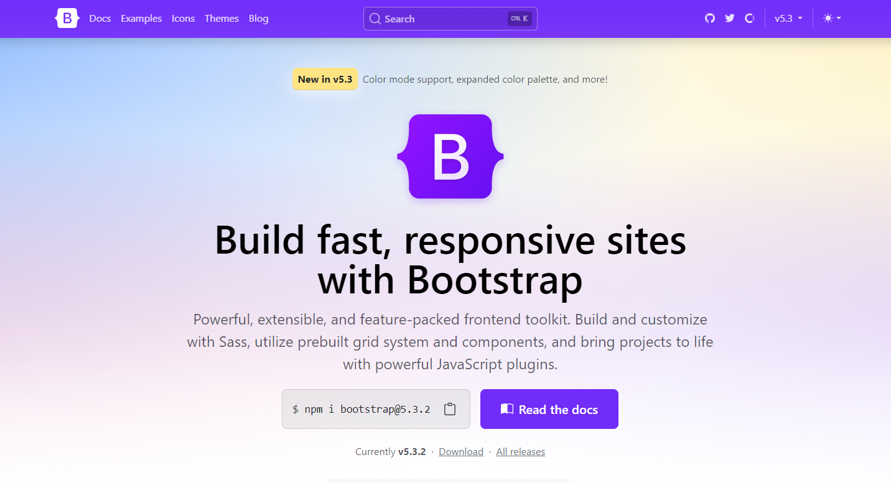

{ .img-fluid }

> It’s official, the final stable release of v5.3.0 has landed! It’s been a monumental effort to revamp our codebase for CSS variables and color modes, one that will see continued changes leading up to an eventual Bootstrap 6. And we’re so excited to finally ship it!

On top of all the work that’s gone into this release, a lot has happened behind the scenes since we shipped our pre-releases. Keep reading to learn everything that’s [new in v5.3.0](https://blog.getbootstrap.com/2023/05/30/bootstrap-5-3-0/).
